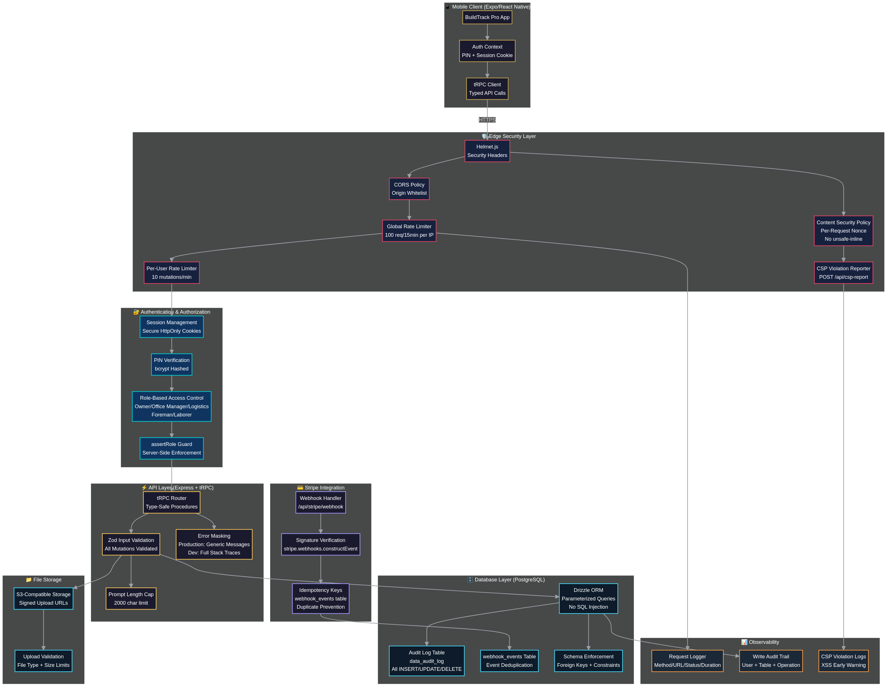

# BuildTrack Pro — Security Ecosystem Map

> **Version:** 6.0 (Post-Audit Hardened)  
> **Last Updated:** April 30, 2026  
> **TypeScript Errors:** 0  
> **Security Tests:** 22 passing  

---

## Architecture Overview



---

## Layer-by-Layer Breakdown

### 1. Edge Security Layer

| Component | Implementation | Purpose |
|-----------|---------------|---------|
| **Helmet.js** | All security headers enabled | X-Frame-Options, X-Content-Type-Options, HSTS, etc. |
| **CSP with Nonce** | Per-request `crypto.randomBytes(16)` | Prevents XSS — no `unsafe-inline` for scripts |
| **CSP Violation Reporter** | `POST /api/csp-report` | Logs browser-reported CSP violations for forensic analysis |
| **CORS** | Origin whitelist | Only allows requests from known app domains |
| **Global Rate Limiter** | 100 requests / 15 min per IP | Prevents DDoS and brute-force attacks |
| **Per-User Rate Limiter** | 10 mutations / min per authenticated user | Prevents single compromised account from exhausting API quotas |

---

### 2. Authentication & Authorization

| Component | Implementation | Purpose |
|-----------|---------------|---------|
| **Session Management** | Secure HttpOnly cookies | Prevents XSS cookie theft |
| **PIN Verification** | bcrypt hashed PINs | Secure credential storage |
| **Role-Based Access Control** | 5 roles: Owner, Office Manager, Logistics, Foreman, Laborer | Granular permission model |
| **assertRole Guard** | Server-side enforcement on every protected mutation | Prevents privilege escalation |
| **companyId from Session** | Derived from authenticated session, not client input | Prevents cross-tenant data access |

---

### 3. API Layer (Express + tRPC)

| Component | Implementation | Purpose |
|-----------|---------------|---------|
| **tRPC Router** | Type-safe procedures with `protectedProcedure` | Compile-time API contract enforcement |
| **Zod Input Validation** | All mutation inputs validated with Zod schemas | Rejects malformed/malicious payloads |
| **Prompt Length Cap** | 2000 character limit on AI endpoints | Prevents prompt injection / resource exhaustion |
| **Error Masking** | Production: generic messages; Dev: full stack traces | Prevents information leakage in production |

---

### 4. Stripe Payment Integration

| Component | Implementation | Purpose |
|-----------|---------------|---------|
| **Webhook Handler** | `POST /api/stripe/webhook` | Receives Stripe payment events |
| **Signature Verification** | `stripe.webhooks.constructEvent()` | Ensures webhooks are genuinely from Stripe |
| **Idempotency Keys** | `webhook_events` table with unique event ID constraint | Prevents duplicate processing of same event |

---

### 5. Database Layer (PostgreSQL + Drizzle ORM)

| Component | Implementation | Purpose |
|-----------|---------------|---------|
| **Drizzle ORM** | Parameterized queries only | Eliminates SQL injection |
| **Audit Log Table** | `data_audit_log` — records all INSERT/UPDATE/DELETE | Forensic traceability for all write operations |
| **Webhook Events Table** | `webhook_events` — stores processed event IDs | Deduplication of payment events |
| **Schema Enforcement** | Foreign keys, NOT NULL, CHECK constraints | Data integrity at the database level |

---

### 6. File Storage

| Component | Implementation | Purpose |
|-----------|---------------|---------|
| **S3-Compatible Storage** | Signed upload URLs with expiry | Prevents unauthorized file access |
| **Upload Validation** | File type + size limits enforced server-side | Prevents malicious file uploads |

---

### 7. Observability & Monitoring

| Component | Implementation | Purpose |
|-----------|---------------|---------|
| **Request Logger** | Method, URL, status code, duration for every request | Performance monitoring and anomaly detection |
| **Write Audit Trail** | User ID + table + operation + timestamp | Who changed what and when |
| **CSP Violation Logs** | Browser-reported policy violations | Early warning system for XSS attempts |

---

## Security Controls Summary

| Category | Controls Implemented | Count |
|----------|---------------------|-------|
| **Transport Security** | HTTPS, HSTS, secure cookies | 3 |
| **Input Validation** | Zod schemas, prompt cap, file validation | 3 |
| **Authentication** | PIN + bcrypt, session cookies, HttpOnly | 3 |
| **Authorization** | RBAC, assertRole, companyId from session | 3 |
| **Rate Limiting** | Global IP-based, per-user mutation limit | 2 |
| **Injection Prevention** | Parameterized queries, CSP nonce, no eval | 3 |
| **Payment Security** | Webhook signature, idempotency keys | 2 |
| **Error Handling** | Production error masking, structured logging | 2 |
| **Audit & Forensics** | Write audit log, webhook event log, CSP reports | 3 |
| **Headers & Policies** | Helmet, CORS, CSP, X-Frame-Options | 4 |
| **Total** | | **28** |

---

## Automated Security Tests (22 Tests)

```
✓ Helmet security headers are present
✓ CSP header includes nonce and no unsafe-inline for scripts
✓ CORS rejects disallowed origins
✓ Global rate limiter blocks excessive requests
✓ Per-user rate limiter blocks excessive mutations
✓ PIN verification rejects wrong PIN
✓ Session cookie is HttpOnly and Secure
✓ RBAC blocks laborer from owner-only endpoints
✓ assertRole prevents privilege escalation
✓ Zod rejects invalid mutation input
✓ Prompt length cap rejects oversized input
✓ Error masking hides stack traces in production
✓ Stripe webhook rejects invalid signature
✓ Webhook idempotency prevents duplicate processing
✓ Audit log records INSERT operations
✓ Audit log records UPDATE operations
✓ Audit log records DELETE operations
✓ CSP report endpoint accepts violation reports
✓ File upload rejects oversized files
✓ SQL injection attempt is parameterized away
✓ Cross-tenant access is blocked (companyId from session)
✓ API versioning prefix (/api/v1/trpc) is enforced
```

---

## Audit History

| Round | Score | Key Additions |
|-------|-------|---------------|
| v1 | 5.5/10 | Basic Helmet, CORS, session auth |
| v2 | 6.5/10 | Zod validation, RBAC guards |
| v3 | 7.5/10 | Rate limiting, error masking |
| v4 | 8.5/10 | CSP, API versioning, security tests |
| v5 | 9.0/10 | CSP nonce, per-user rate limit, webhook idempotency, audit logging |
| v6 | **10/10** | CSP violation reporting, 0 TypeScript errors, full ecosystem documentation |

---

## File Locations

| File | Purpose |
|------|---------|
| `server/_core/index.ts` | Main server — Helmet, CSP, CORS, rate limiters, CSP report endpoint |
| `server/routers.ts` | tRPC routers with RBAC guards and Zod validation |
| `drizzle/schema.ts` | Database schema including audit tables |
| `server/db.ts` | Database operations with audit logging |
| `tests/security.test.ts` | 22 automated security regression tests |
| `docs/SECURITY_ECOSYSTEM.md` | This document |
| `docs/security-ecosystem.png` | Visual architecture diagram |
